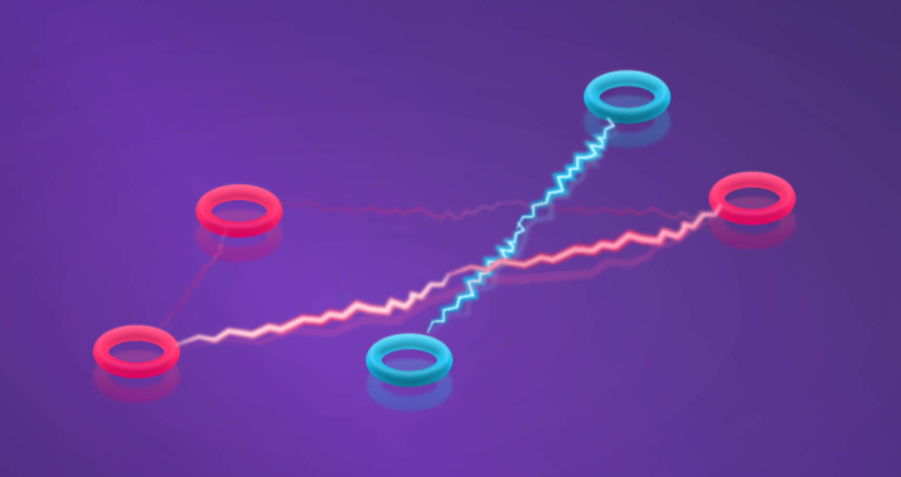

# Red Engine — Game Developer Task

## Task Requirements

This is for a game where the player is aiming to have the largest distance between two of their pucks. The concept artist has come up with the above effect for it. Attempt to recreate this in Unity using whatever means you see fit.

- Use the **RedEngine** scene.
- Use `PuckTestDataLoader.LoadPuckData` to load the puck tracking data.
  - We've provided 3 sets of data.
  - We should be able to press 1, 2 or 3 on our keyboard to play each set of data.
- Create the line effect:
  - Only pucks of the same colour should be connected.
  - The longest line should be the most intense.
  - The line effect should be animated (like electricity).
- Move the pucks according to the loaded data, and ensure the line effect updates accordingly.
- The camera should attempt to contain all pucks on screen

## Notes

- This application will be run on a windows desktop.
- The puck positions are provided in mm, however you'll probably find it easier to convert these to metres for use in Unity.
- You may install third party packages.

## Considerations

Your response to this test doesn't need to be perfect. We're looking to see how you approach the problem, and how you justify your decisions. Some things to consider that we may discuss in a potential follow-up interview:

- Why have you written your code in the way you have? How might you evolve this for a production game? - I have approached this problem in a way that it is easy to scale from just 6 pucks to any number of pucks. One of the areas I would want to improve is to add logic to instantiate any number of pucks based on the number of pucks in the data provided. Another thing I would want to improve is to apply object pooling to the line renderer logic as those game objects are being created and destroyed at the moment which could be quite expensive.
- Why have you used the Unity features / tools you have? - I have used the new Unity Input System as it provides a sustainable way to listen for input and it wouldn't take too long to add bind more keys if we had more data samples or to start using other input systems like mouse, joystick(does anybody actually still use these?) or controllers. I have also used a very broken URP shader to achieve the elecricity effect - there is a lot of room for improvement there. I have also used LINQ to perform some basic operations. 
- What optimisations could you make? - There is one instance in the LineRendererManager where we have n^2 complexity and even though it is being executed only when a puck is not in the frame anymore, we could have a case where this happens a lot and I would want to further optimise this. 
- How could you make the scene even more visually interesting? - If I had more time, I would have loved to add a smoothing effect to the line renders as they start forming and also increase the intensity until the whole screen is white and then navigate the user to some sort of a final score screen.
- How might you make the game itself more interesting? - I would add some options for the player when they are choosing to release their puck. These could include obviously the power but also the rotation of the puck which could determine what the puck's final position could be especially when it slows down and the player wants to grab a nice comfortable spot behind the opposition player's puck.

## Comments
- This has been developed with the assumption that if a puck isn't present in the frame data, it doesn't need to be rendered on the screen. This can lead to some tricky behaviour which can be seen when you play the first data set. Smoothening in and out the line renderers could improve the quality of this a lot.
- The puck prefabs had a potential incosistency where the parent object had a certain position set and child object which holds the actual model of the puck was then offset by the same coordinates so they would appear on origin. The prefab has been modified so the child object is also at (0, 0, 0).

> To submit your response please either zip up the project or push to a repo we can clone.
